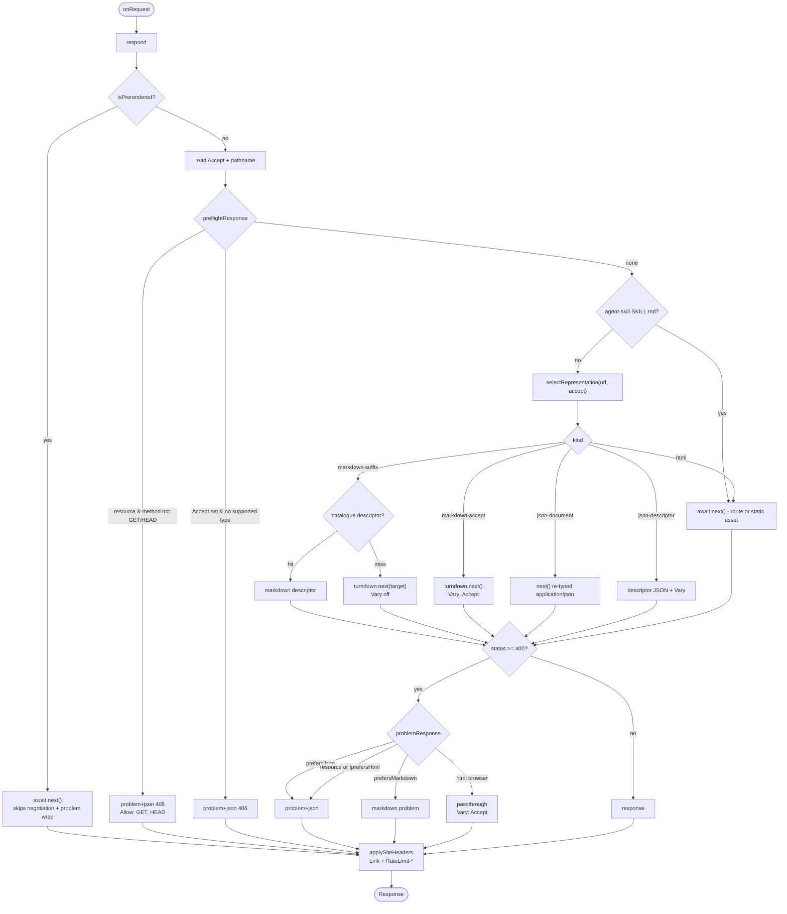

# Middleware

`src/middleware.ts` is a thin shim over `src/features/discovery/` (see
[ADR 008](adr/008-single-discovery-module.md)). It does three things: advertises
the discovery surface with response headers, negotiates the representation of a
page or discovery resource, and converts errors into RFC 9457 problems. The
vocabulary below matches [CONTEXT.md](CONTEXT.md).

## Request flow

## Branches

| #   | Guard                                  | Location            | Result                                                              |
| --- | -------------------------------------- | ------------------- | ------------------------------------------------------------------- |
| 1   | `isPrerendered`                        | `middleware.ts:62`  | `next()`, bypasses preflight, negotiation and problem wrapping      |
| 2a  | resource path and method not GET/HEAD  | `problems.ts:193`   | 405 problem+json with `Allow`, bypasses problem wrapping            |
| 2b  | `Accept` set and no supported type     | `problems.ts:200`   | 406 problem+json, bypasses problem wrapping                         |
| 3   | agent skill artifact path              | `middleware.ts:69`  | `next()` untouched, still problem-wrapped                           |
| 4a  | path ends `.md`                        | `negotiation.ts:84` | `markdown-suffix`                                                   |
| 4b  | catalogued resource and JSON preferred | `negotiation.ts:88` | `json-document` when the media type is JSON, else `json-descriptor` |
| 4c  | markdown preferred                     | `negotiation.ts:95` | `markdown-accept`                                                   |
| 4d  | otherwise                              | `negotiation.ts:97` | `html`                                                              |
| 5   | `status >= 400`                        | `middleware.ts:73`  | `problemResponse`                                                   |
| 6   | always                                 | `middleware.ts:14`  | `Link` and `RateLimit-*`                                            |

The four kinds resolve as follows:

- `markdown-suffix` — the catalogue descriptor for the rewritten path, else a
  turndown of the target (`resource-markdown.ts:30`, `middleware.ts:43`).
- `markdown-accept` — a turndown of `next()` with `Vary: Accept`
  (`middleware.ts:47`).
- `json-document` — `next()` re-typed as `application/json`, so a JSON resource
  is forwarded as its own document (`middleware.ts:50`).
- `json-descriptor` — `Response.json(describeResource(...))`, a synthesised
  descriptor for a resource whose own media type is not JSON
  (`middleware.ts:53`, `resource-json.ts:27`).
- `html` — `next()`.

`problemResponse` (`problems.ts:180`) prefers JSON, then markdown, then
problem+json when the path is a resource (`/.well-known/*`, catalogued
resources) or the client does not explicitly prefer HTML; otherwise it passes
the original error through with `Vary: Accept`. `*/*` is not an HTML preference
— it expresses no preference, so it receives problem+json.

## Notes

- Site headers apply to every response, including prerendered and error
  responses. Negotiation and problem wrapping do not.
- Preflight returns at `middleware.ts:67` and the prerendered bypass at
  `middleware.ts:62`, both before the `status >= 400` wrap, so a 405 or 406 is
  never re-wrapped as a problem. The agent skill bypass sits after preflight but
  before negotiation, so it is problem-wrapped.
- `formatMarkdownResponse` returns a non-HTML response unchanged
  (`markdown.ts:18`), so the two markdown branches silently skip both conversion
  and `Vary` in that case.
- The canned problems cover 404, 405, 406 and 500; any other status falls back
  to a server-error-shaped body carrying the original status (`problems.ts:77`).
- `isResourcePath` matches any `/.well-known/*` path, not only catalogued ones
  (`catalog.ts:141`), so 405 and 406 apply more widely than descriptor
  negotiation does.
- `prefersHtml` (`negotiation.ts:71`) requires an explicit `text/html` or
  `text/*`; `acceptsSupportedRepresentation` still counts `*/*`, so a wildcard
  client is never rejected with a 406.
