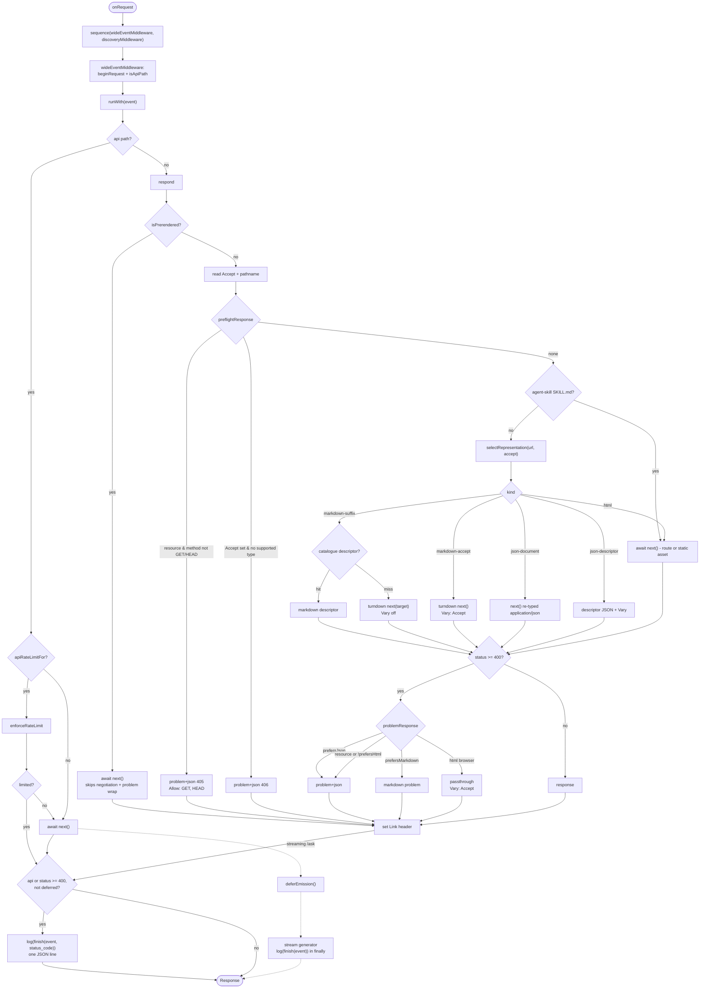

# Middleware

`src/middleware.ts` is a thin shim that chains two handlers with `sequence`.
The outermost, `wideEventMiddleware` in `src/lib/wide-event-middleware.ts`,
opens one wide event per request and closes it after the response (see
[logging.md](logging.md) and [ADR 016](adr/016-wide-event-logging.md)). The
inner `discoveryMiddleware` is a shim over `src/features/discovery/` (see
[ADR 008](adr/008-single-discovery-module.md)): it advertises the discovery
surface with response headers, negotiates the representation of a page or
discovery resource, converts errors into RFC 9457 problems, and meters API
paths. The vocabulary below matches [GLOSSARY.md](GLOSSARY.md).

## Request flow

```mermaid
flowchart TD
    A([onRequest]) --> SEQ["sequence(wideEventMiddleware, discoveryMiddleware)"]
    SEQ --> EV["wideEventMiddleware:<br/>beginRequest + isApiPath"]
    EV --> RW["runWith(event)"]
    RW --> API{api path?}

    API -- yes --> RLC{apiRateLimitFor?}
    RLC -- yes --> ENF[enforceRateLimit]
    ENF --> LIM{limited?}
    LIM -- yes --> X
    LIM -- no --> NXT["await next()"]
    RLC -- no --> NXT
    NXT --> X
    NXT -. "streaming /ask" .-> DEF["deferEmission()"]

    API -- no --> B[respond]
    B --> C{isPrerendered?}
    C -- yes --> PRE["await next()<br/>skips negotiation + problem wrap"] --> W
    C -- no --> D["read Accept + pathname"]
    D --> E{preflightResponse}
    E -- "resource & method not GET/HEAD" --> M405["problem+json 405<br/>Allow: GET, HEAD"] --> W
    E -- "Accept set & no supported type" --> M406["problem+json 406"] --> W
    E -- none --> F{agent-skill SKILL.md?}
    F -- yes --> PASS
    F -- no --> G["selectRepresentation(url, accept)"]
    G --> H{kind}
    H -- markdown-suffix --> I{catalogue descriptor?}
    I -- hit --> J["markdown descriptor"] --> Q
    I -- miss --> K["turndown next(target)<br/>Vary off"] --> Q
    H -- markdown-accept --> L["turndown next()<br/>Vary: Accept"] --> Q
    H -- json-document --> N["next() re-typed application/json"] --> Q
    H -- json-descriptor --> O["descriptor JSON + Vary"] --> Q
    H -- html --> PASS
    PASS["await next() - route or static asset"] --> Q
    Q{"status >= 400?"}
    Q -- no --> R[response]
    Q -- yes --> S{problemResponse}
    S -- prefersJson --> T["problem+json"] --> W
    S -- prefersMarkdown --> U["markdown problem"] --> W
    S -- "resource or !prefersHtml" --> T
    S -- "html browser" --> V["passthrough<br/>Vary: Accept"] --> W
    R --> W
    W["set Link header"] --> X

    X{"api or status >= 400,<br/>not deferred?"}
    X -- yes --> FIN["log(finish(event, status_code))<br/>one JSON line"] --> RET([Response])
    X -- no --> RET
    DEF -.-> OWN["stream generator<br/>log(finish(event)) in finally"]
    OWN -.-> RET
```

## Branches

| #   | Guard                                  | Location            | Result                                                              |
| --- | -------------------------------------- | ------------------- | ------------------------------------------------------------------- |
| 1   | `isPrerendered`                        | `middleware.ts:56`  | `next()`, bypasses preflight, negotiation and problem wrapping      |
| 2a  | resource path and method not GET/HEAD  | `problems.ts:193`   | 405 problem+json with `Allow`, bypasses problem wrapping            |
| 2b  | `Accept` set and no supported type     | `problems.ts:200`   | 406 problem+json, bypasses problem wrapping                         |
| 3   | agent skill artifact path              | `middleware.ts:63`  | `next()` untouched, still problem-wrapped                           |
| 4a  | path ends `.md`                        | `negotiation.ts:84` | `markdown-suffix`                                                   |
| 4b  | catalogued resource and JSON preferred | `negotiation.ts:88` | `json-document` when the media type is JSON, else `json-descriptor` |
| 4c  | markdown preferred                     | `negotiation.ts:95` | `markdown-accept`                                                   |
| 4d  | otherwise                              | `negotiation.ts:97` | `html`                                                              |
| 5   | `status >= 400`                        | `middleware.ts:67`  | `problemResponse`                                                   |
| 6   | non-API path                           | `middleware.ts:86`  | `Link`                                                              |
| 7   | API path with a configured limit       | `middleware.ts:77`  | `enforceRateLimit` returns `429` or `null`                          |

The four kinds resolve as follows:

- `markdown-suffix` — the catalogue descriptor for the rewritten path, else a
  turndown of the target (`resource-markdown.ts:30`, `middleware.ts:38`).
- `markdown-accept` — a turndown of `next()` with `Vary: Accept`
  (`middleware.ts:42`).
- `json-document` — `next()` re-typed as `application/json`, so a JSON resource
  is forwarded as its own document (`middleware.ts:45`).
- `json-descriptor` — `Response.json(describeResource(...))`, a synthesised
  descriptor for a resource whose own media type is not JSON
  (`middleware.ts:48`, `resource-json.ts:27`).
- `html` — `next()`.

`problemResponse` (`problems.ts:180`) prefers JSON, then markdown, then
problem+json when the path is a resource (`/.well-known/*`, catalogued
resources) or the client does not explicitly prefer HTML; otherwise it passes
the original error through with `Vary: Accept`. `*/*` is not an HTML preference
— it expresses no preference, so it receives problem+json.

## Notes

- The `Link` header applies to every non-API response, including prerendered and
  error responses. Negotiation and problem wrapping do not; API paths bypass all
  three.
- `wideEventMiddleware` is the outermost handler; the discovery work happens in
  the inner `discoveryMiddleware`. `sequence` guarantees the event wraps the
  whole request whichever inner branch returns.
- One wide event is opened for every request, emitted for API paths always and
  for non-API paths at or above 400. A streaming `/ask` response defers emission
  to the stream generator. See [logging.md](logging.md) and
  [ADR 016](adr/016-wide-event-logging.md).
- Preflight returns at `middleware.ts:60` and the prerendered bypass at
  `middleware.ts:56`, both before the `status >= 400` wrap, so a 405 or 406 is
  never re-wrapped as a problem. The agent skill bypass sits at
  `middleware.ts:63`, after preflight but before negotiation, so it is
  problem-wrapped.
- The rate limiter returns the `429` response when a client is over quota and
  `null` otherwise; the response status is what the wide event records. When the
  check fails open (no client IP, missing `RATE_LIMIT_SALT`, blob-store error)
  the limiter warns on its own and returns `null`.
- `formatMarkdownResponse` returns a non-HTML response unchanged
  (`markdown.ts:18`), so the two markdown branches silently skip both conversion
  and `Vary` in that case.
- The canned problems cover 404, 405, 406 and 500; any other status falls back
  to a server-error-shaped body carrying the original status (`problems.ts:77`).
- `isResourcePath` matches any `/.well-known/*` path, not only catalogued ones
  (`catalog.ts:141`), so 405 and 406 apply more widely than descriptor
  negotiation does.
- `prefersHtml` (`negotiation.ts:71`) requires an explicit `text/html` or
  `text/*`; `acceptsSupportedRepresentation` still counts `*/*`, so a wildcard
  client is never rejected with a 406.
